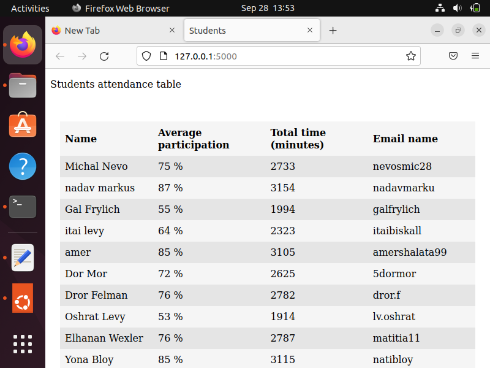

# Flask-Docker

### For this project I used MYSQL database and Flask python for communicating with the database server, process the data and for rendering the html to the browser

Here you can find my docker image: 

[dockerhub repository](https://hub.docker.com/repository/docker/nevosmic/bynet_docker)

[video](https://im2.ezgif.com/tmp/ezgif-2-64da1161d7.mp4)
https://im2.ezgif.com/tmp/ezgif-2-64da1161d7.mp4

